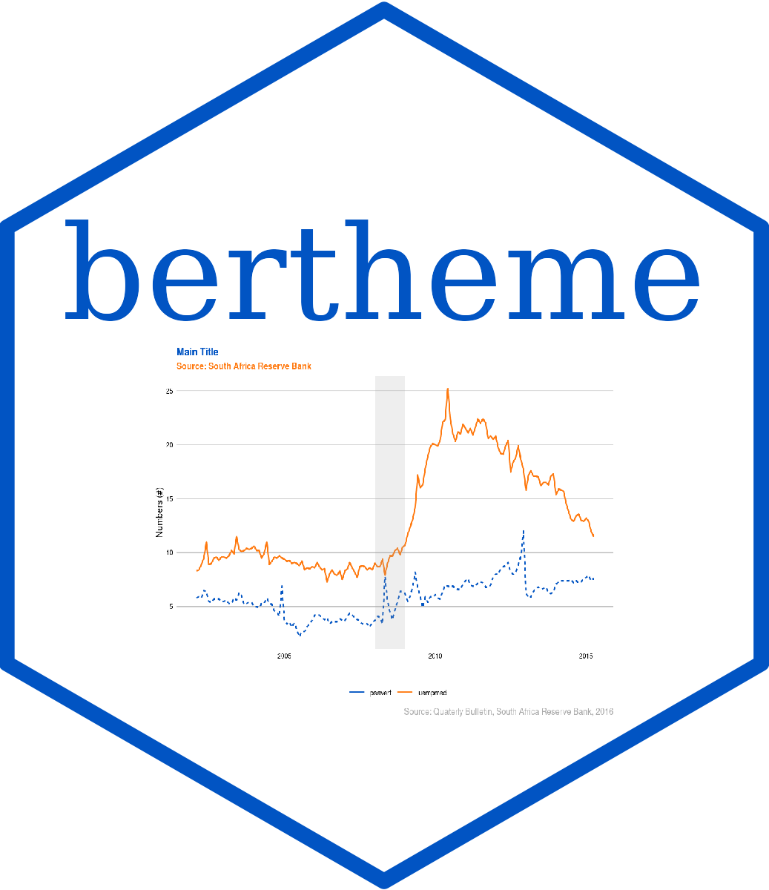

```{r setup, include=FALSE}
knitr::opts_chunk$set(
   echo = TRUE, 
   comment= NA,
   eval = TRUE, 
   fig.height = 6, 
   fig.width = 8, 
   fig.pos = "center",
   fig.path = "man/figures/")

# options(tibble.width = Inf)
# pkgdown::build_site()

show_colors <- function(color_name) {
  colors <- bertheme_data()[[color_name]]
  ggplot(data.frame(id = seq_along(colors), color = colors)) + 
    geom_tile(aes(id, 1, fill = color)) + 
    scale_fill_identity()+
    labs(title = color_name) +
    theme_void()
}
```

# bertheme 

[](https://www.tidyverse.org/lifecycle/#experimental)
[](https://github.com/Bureau-for-Economic-Research/bertheme/commits/develop)

## About 

This is the homepage for the {bertheme} R package <https://github.com/Bureau-for-Economic-Research/bertheme>.

Bureau for Economic Research ggplot2 theme. Theme based on the plots in \emph{Bureau for Economic Research} reporting.

## Installation

Install from GitHub.

```{r eval = FALSE}
remotes::install_github("Bureau-for-Economic-Research/bertheme")
```

## Color palettes

```{r, fig.height=2, echo=FALSE}
library(bertheme)
library(ggplot2)
purrr::map(names(bertheme_data()), ~show_colors(.x))
```


## Usage

```{r check-version}
packageVersion("bertheme")
```

### Line Chart

```{r line_chart}
suppressMessages(library(dplyr))
library(bertheme)
library(scales)
library(ggplot2)

p <- economics_long %>%
  filter(variable %in% c("psavert", "uempmed")) %>% 
  filter(date > "2002-01-01") %>% 
  ggplot(., aes(x = date, y = value, color = variable, lty = rev(variable))) +
  geom_line(lwd = 1)

p + 
  scale_colour_ber("core") +
  scale_y_continuous(labels = comma) +
  labs(
    title = "Main Title",
    subtitle = "Growth Y-o-Y (%)",
    y = "",
    x = "",
    caption = "Source: Quaterly Bulletin, South Africa Reserve Bank, 2016"
  ) +
  scale_x_date(date_labels = "%Y-%m-%d") + 
  guides(linetype = "none")+
  geom_event(start = "2008-01-01", end = "2009-01-01", # Add for event highlight
             label = "", 
             alpha = 0.1) + 
  theme_ber() 

```

### Line Chart with Reference

```{r line_chart_reference}

p + 
  scale_colour_ber("core") +
  scale_y_continuous(labels = comma) +
  labs(
    title = "Main Title",
    subtitle = "Growth Y-o-Y (%)",
    y = "",
    x = "",
    caption = "Source: Quaterly Bulletin, South Africa Reserve Bank, 2016"
  ) +
  guides(linetype = "none") +
  geom_reference(xdate = as.Date('2015-04-01'), # Add to add a reference line
                 yintercept = 17.6, 
                 label = "Average\nUnemployed", 
                 angle = 0, 
                 hjust = 0.75,
                 vjust = 0.5,
                 label_color = "black") +
  geom_event(start = "2008-01-01", end = "2009-01-01", 
             label = "", 
             alpha = 0.1) + 
  theme_ber() 
```

### Aligning Title and subtitle

To align the title and subtile with the leftmost edge of the plot you can include the following. The hjust parameter needs to be manually adjusted to suit your plot. If it is falling off the plot, make the parameter smaller (e.g -0.05), but if it is too far to the left, make the parameter larger (e.g -0.15).

```{r eval=FALSE, include=TRUE}
 
p + theme(plot.title = element_text(hjust = -0.1),
          plot.subtitle = element_text(hjust = -0.1))

```

### Mixed Chart

```{r mixed_chart}
p <- ggplot() +
  geom_area(data = economics, aes(x = date, y = uempmed, fill = "PCI"), alpha = 0.5) +
  geom_line(data = economics, aes(x = date, y = psavert, color = "CCI")) +
  geom_smooth(data = economics, aes(x = date, y = psavert, color = "CCI")) +
  scale_fill_manual(values = bertheme_data()$core[1], name = "Legend") +
  scale_color_manual(values = bertheme_data()$core[2], name = "Legend") +
  guides(fill = guide_legend(override.aes = list(linetype = 1, color = bertheme_data()$core[1])),
         color = guide_legend(override.aes = list(linetype = 1)))

p + 
  scale_y_continuous(labels = comma) +
  labs(
    title = "Main Title",
    subtitle = "Growth Y-o-Y (%)",
    y = "",
    x = "",
    caption = "Source: Quaterly Bulletin, South Africa Reserve Bank, 2016"
  ) +
  guides(linetype = "none")+
  geom_event(start = "2008-01-01", end = "2009-01-01", 
             label = "", 
             alpha = 0.25) + 
  theme_ber() 

```

### Pie Chart

```{r}
# Create Data
data <- data.frame(
  group = LETTERS[1:5],
  value = c(13,7,9,21,2)
)

# Compute the position of labels
data <- data %>% 
  arrange(desc(group)) %>%
  mutate(prop = value / sum(data$value) *100) %>%
  mutate(ypos = cumsum(prop)- 0.5*prop )

# Basic piechart
ggplot(data, aes(x = "", y = prop, fill = group)) +
  geom_bar(stat = "identity", width = 1, color = "white") +
  coord_polar("y", start = 0) +
  theme_void() + 
  theme(legend.position = "none") +
  geom_text(aes(y = ypos, label = group), color = "white", size = 6) +
  scale_fill_ber(palette = "core") 

```

### Bar Chart

```{r}
# library
library(ggplot2)

# create a dataset
specie <- c(rep("sorgho" , 3) , rep("poacee" , 3) , rep("banana" , 3) , rep("triticum" , 3) )
condition <- rep(c("normal" , "stress" , "nitrogen") , 4)
value <- abs(rnorm(12 , 0 , 15))
data <- data.frame(specie, condition, value)
 
# Small multiple
ggplot(data, aes(fill = condition, y = value, x = specie)) + 
    geom_bar(position = "stack", stat = "identity") +
    scale_fill_ber(palette = "core") +
    theme_ber() +
    labs(
      subtitle = "Growth Y-o-Y (%)",
      y = "",
      x = "", 
      title = "This is main heading")
```

### Histogram

```{r}
# Build dataset with different distributions
data <- data.frame(
  type = c( rep("variable 1", 1000), rep("variable 2", 1000), rep("variable 3", 1000)),
  value = c( rnorm(1000), rnorm(1000, mean = 4), rnorm(1000, mean = 6, sd = 4) )
)

# Represent it
data %>%
  ggplot( aes(x = value, fill = type)) +
    geom_histogram( color = "#e9ecef", alpha = 0.6, position = 'identity') +
    scale_fill_ber(palette = "darks") +
    theme_ber() +
    labs(
      fill = "", 
      subtitle = "Growth Y-o-Y (%)",
      y = "", 
      x = "")
```

### Slope Chart

```{r}
# Loading required packages
library(tidyverse)
library(ggrepel)
library(bertheme)

# Loading data
df <- read_csv("https://raw.githubusercontent.com/GDS-ODSSS/unhcr-dataviz-platform/master/data/change_over_time/slope.csv")

# Plot
ggplot(df, aes(
  x = year,
  y = refugee_number,
  group = country_origin
)) +
  geom_line(
    linewidth = 0.75,
    color = bertheme_data()$core[1]
  ) +
  geom_text_repel(
    data = df |> filter(year == 2016),
    aes(label = paste(
      country_origin,
      if_else(refugee_number > 1e6,
              paste0(round(refugee_number / 1e6, 1), "M"),
              paste0(round(refugee_number / 1e3, 1), "k")
      )
    )),
    size = 8 / .pt,
    hjust = 1,
    direction = "y",
    nudge_x = -0.3
  ) +
  geom_text_repel(
    data = df |> filter(year == 2021),
    aes(label = paste(
      country_origin,
      if_else(refugee_number > 1e6,
              paste0(round(refugee_number / 1e6, 1), "M"),
              paste0(round(refugee_number / 1e3, 1), "k")
      )
    )),
    size = 8 / .pt,
    hjust = 0,
    direction = "y",
    nudge_x = 0.3
  ) +
  geom_point(
    size = 2.5,
    color = bertheme_data()$core[2]
  ) +
  labs(
    title = "Evolution of refugee population in East and\nHorn of Africa region | 2016 vs 2021",
    caption = "Source: UNHCR Refugee Data Finder\n© UNHCR, The UN Refugee Agency"
  ) +
  scale_x_continuous(
    breaks = c(2016, 2021),
    limits = c(2013, 2024)
  ) +
  scale_y_continuous(limits = c(-2e5, NA)) +
  theme_void() +
  theme(panel.grid.major.x = element_line(colour = "grey", linewidth = 1), 
        axis.text.x = element_text(face = "bold", color="grey", 
                                   size = 14))
  

```


## Demo Plots

### Core

```{r}
library(bertheme)
library(colorspace)
demoplot(bertheme_data()[['core']], type = "lines")
demoplot(bertheme_data()[['core']], type = "mosaic")
demoplot(bertheme_data()[['core']], type = "map")
demoplot(bertheme_data()[['core']], type = "scatter")
demoplot(bertheme_data()[['core']], type = "perspective")
demoplot(bertheme_data()[['core']], type = "spine")
demoplot(bertheme_data()[['core']], type = "heatmap")
demoplot(bertheme_data()[['core']], type = "pie")
```

