# bertheme 

[](https://www.tidyverse.org/lifecycle/#experimental)
[](https://github.com/Bureau-for-Economic-Research/bertheme/commits/develop)

## About

This is the homepage for the {bertheme} R package
<https://github.com/Bureau-for-Economic-Research/bertheme>.

Bureau for Economic Research ggplot2 theme. Theme based on the plots in
reporting.

## Installation

Install from GitHub.

``` r
remotes::install_github("Bureau-for-Economic-Research/bertheme")
```

## Color palettes

    [[1]]

<!-- -->


    [[2]]

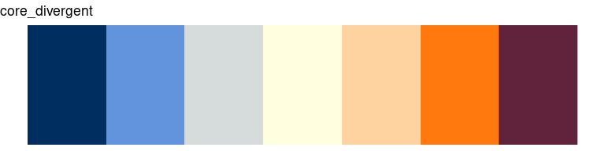<!-- -->


    [[3]]

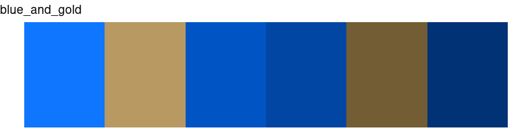<!-- -->


    [[4]]

<!-- -->


    [[5]]

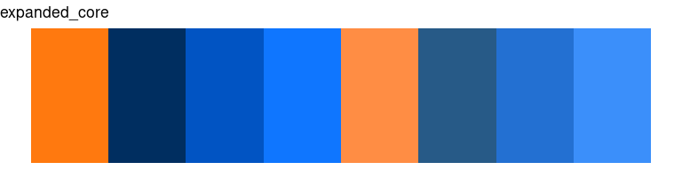<!-- -->


    [[6]]

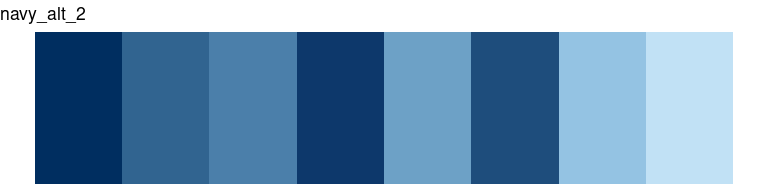<!-- -->

## Usage

``` r
packageVersion("bertheme")
```

    [1] '0.1.0'

### Line Chart

``` r
suppressMessages(library(dplyr))
library(bertheme)
library(scales)
library(ggplot2)

p <- economics_long %>%
  filter(variable %in% c("psavert", "uempmed")) %>% 
  filter(date > "2002-01-01") %>% 
  ggplot(., aes(x = date, y = value, color = variable, lty = rev(variable))) +
  geom_line(lwd = 1)

p + 
  scale_colour_ber("core") +
  scale_y_continuous(labels = comma) +
  labs(
    title = "Main Title",
    subtitle = "Source: South Africa Reserve Bank",
    y = "Numbers (#)",
    x = "",
    caption = "Source: Quaterly Bulletin, South Africa Reserve Bank, 2016"
  ) +
  guides(linetype = "none")+
  geom_event(start = "2008-01-01", end = "2009-01-01", 
             label = "", 
             alpha = 0.1) + 
  theme_ber() 
```

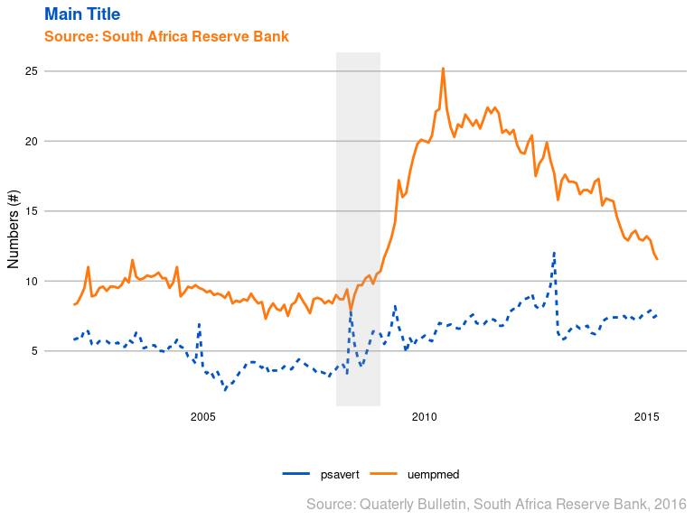<!-- -->

### Mixed Chart

``` r
p <- ggplot() +
  geom_area(data = economics, aes(x = date, y = uempmed, fill = "PCI"), alpha = 0.5) +
  geom_line(data = economics, aes(x = date, y = psavert, color = "CCI")) +
  geom_smooth(data = economics, aes(x = date, y = psavert, color = "CCI")) +
  scale_fill_manual(values = bertheme_data()$core[1], name = "Legend") +
  scale_color_manual(values = bertheme_data()$core[2], name = "Legend") +
  guides(fill = guide_legend(override.aes = list(linetype = 1, color = bertheme_data()$core[1])),
         color = guide_legend(override.aes = list(linetype = 1)))

p + 
  scale_y_continuous(labels = comma) +
  labs(
    title = "Main Title",
    y = "Numbers (#)",
    x = "",
    caption = "Source: Quaterly Bulletin, South Africa Reserve Bank, 2016"
  ) +
  guides(linetype = "none")+
  geom_event(start = "2008-01-01", end = "2009-01-01", 
             label = "", 
             alpha = 0.25) + 
  theme_ber() 
```

    `geom_smooth()` using method = 'loess' and formula = 'y ~ x'

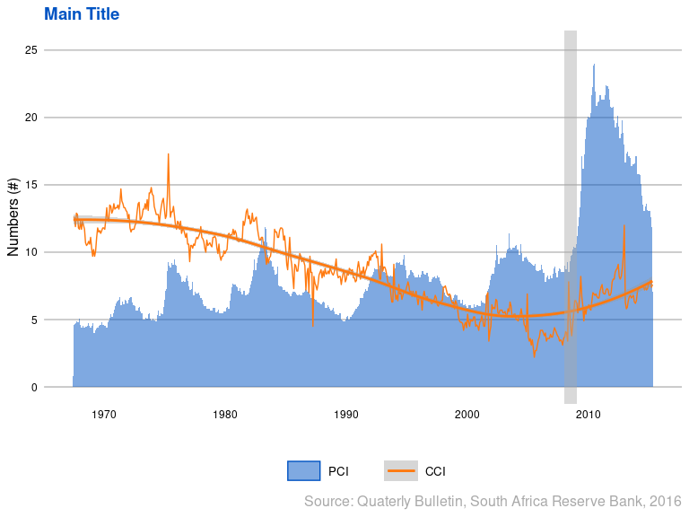<!-- -->

### Pie Chart

``` r
# Create Data
data <- data.frame(
  group = LETTERS[1:5],
  value = c(13,7,9,21,2)
)

# Compute the position of labels
data <- data %>% 
  arrange(desc(group)) %>%
  mutate(prop = value / sum(data$value) *100) %>%
  mutate(ypos = cumsum(prop)- 0.5*prop )

# Basic piechart
ggplot(data, aes(x = "", y = prop, fill = group)) +
  geom_bar(stat = "identity", width = 1, color = "white") +
  coord_polar("y", start = 0) +
  theme_void() + 
  theme(legend.position = "none") +
  geom_text(aes(y = ypos, label = group), color = "white", size = 6) +
  scale_fill_ber(palette = "core") 
```

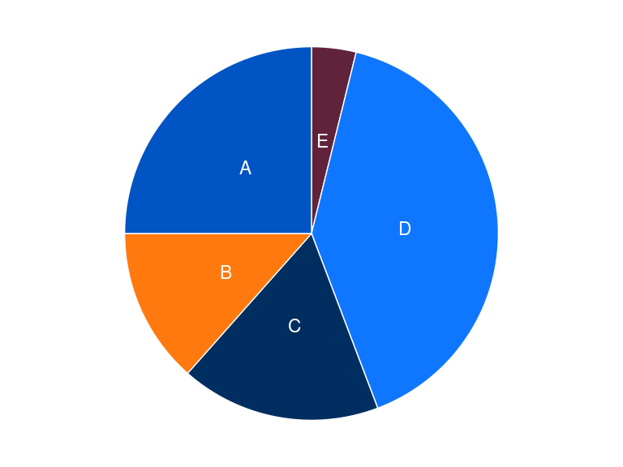<!-- -->

### Bar Chart

``` r
# library
library(ggplot2)

# create a dataset
specie <- c(rep("sorgho" , 3) , rep("poacee" , 3) , rep("banana" , 3) , rep("triticum" , 3) )
condition <- rep(c("normal" , "stress" , "nitrogen") , 4)
value <- abs(rnorm(12 , 0 , 15))
data <- data.frame(specie, condition, value)
 
# Small multiple
ggplot(data, aes(fill = condition, y = value, x = specie)) + 
    geom_bar(position = "stack", stat = "identity") +
    scale_fill_ber(palette = "core") +
    theme_ber() +
    labs(
      y = "",
      x = "", 
      title = "This is main heading")
```

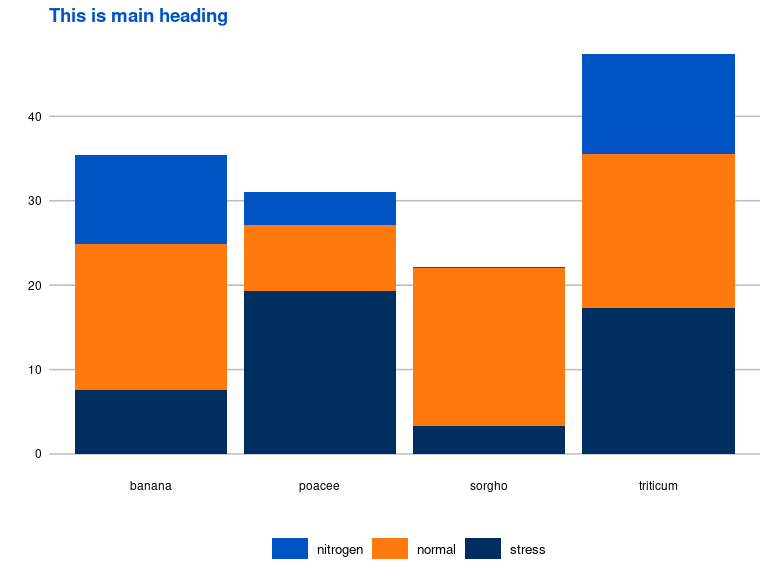<!-- -->

### Histogram

``` r
# Build dataset with different distributions
data <- data.frame(
  type = c( rep("variable 1", 1000), rep("variable 2", 1000), rep("variable 3", 1000)),
  value = c( rnorm(1000), rnorm(1000, mean = 4), rnorm(1000, mean = 6, sd = 4) )
)

# Represent it
data %>%
  ggplot( aes(x = value, fill = type)) +
    geom_histogram( color = "#e9ecef", alpha = 0.6, position = 'identity') +
    scale_fill_ber(palette = "darks") +
    theme_ber() +
    labs(
      fill = "", 
      y = "", 
      x = "")
```

    `stat_bin()` using `bins = 30`. Pick better value with `binwidth`.

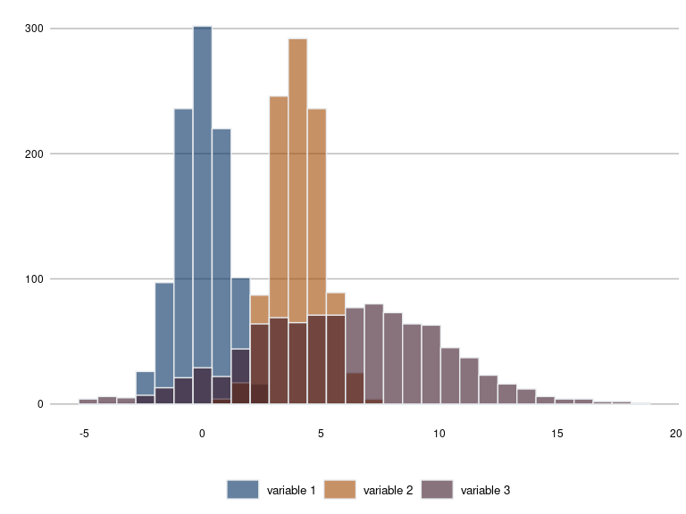<!-- -->

## Demo Plots

### Core

``` r
library(bertheme)
library(colorspace)
demoplot(bertheme_data()[['core']], type = "lines")
```

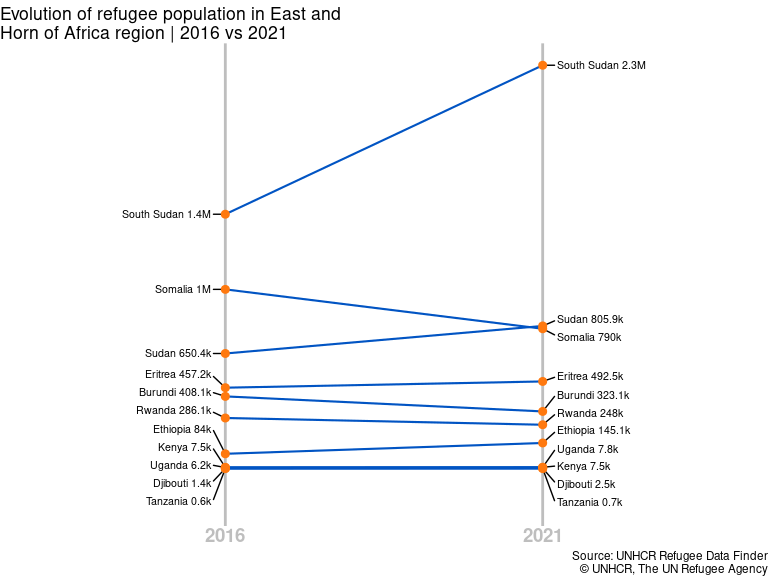<!-- -->

``` r
demoplot(bertheme_data()[['core']], type = "mosaic")
```

<!-- -->

``` r
demoplot(bertheme_data()[['core']], type = "map")
```

<!-- -->

``` r
demoplot(bertheme_data()[['core']], type = "scatter")
```

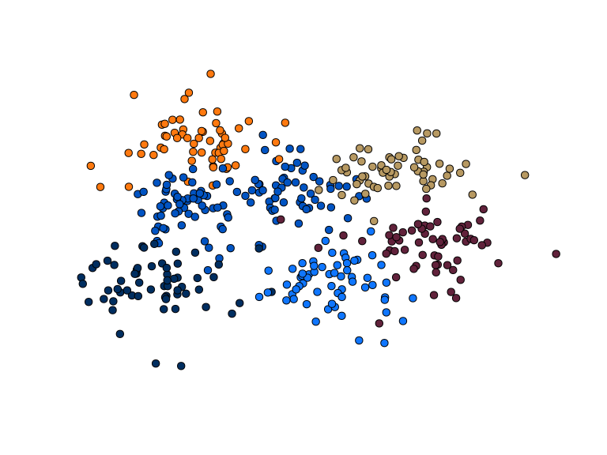<!-- -->

``` r
demoplot(bertheme_data()[['core']], type = "perspective")
```

<!-- -->

``` r
demoplot(bertheme_data()[['core']], type = "spine")
```

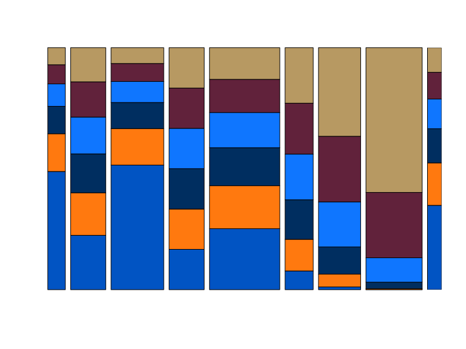<!-- -->

``` r
demoplot(bertheme_data()[['core']], type = "heatmap")
```

<!-- -->

``` r
demoplot(bertheme_data()[['core']], type = "pie")
```

<!-- -->
